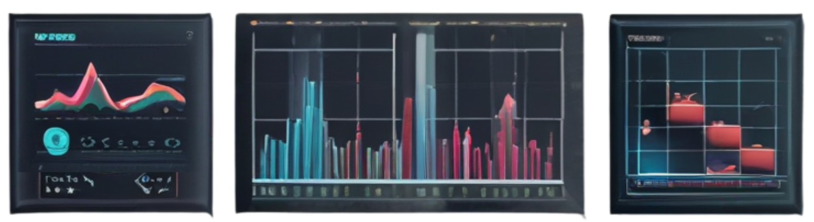
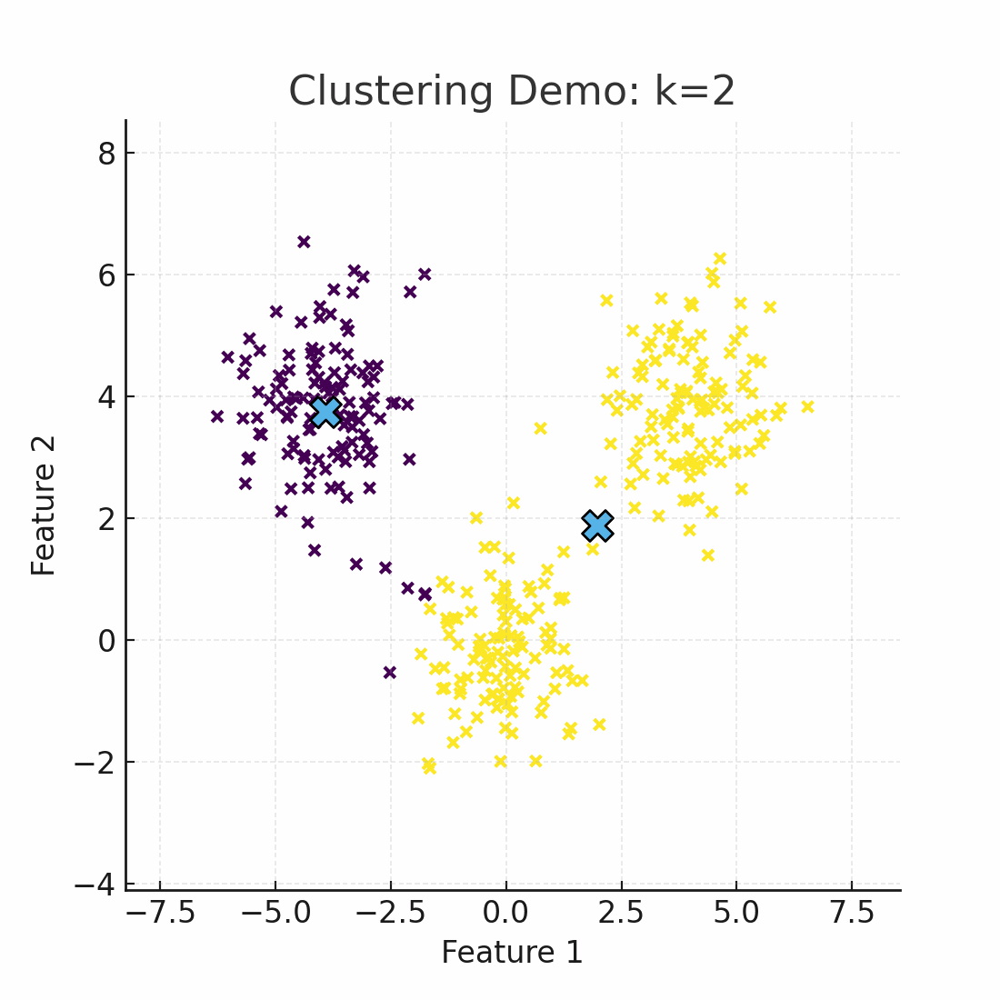

# Streamlit Data Analysis App

## 📖 Overview
**Streamlit Data Analysis App** is a modular, interactive platform for exploring data, running machine learning pipelines, and visualizing insights — all through a simple Streamlit interface.  **A PowerPoint presentation** is included to give a brief overview of the Streamlit application, its purpose, and application for data science projects.

This project demonstrates how to integrate:
- **Exploratory Data Analysis (EDA)**
- **Data profiling & outlier detection**
- **Clustering & segmentation**
- **Machine learning pipelines**
- **Interactive visualizations**

It can serve as:
- A learning tool for students & professionals  
- A reusable framework for analytics projects  
- A demo environment for experimenting with Streamlit apps  

#### To launch app, click https://data-analysis-app-example.streamlit.app/
---

## 📂 Repository Structure
Streamlit_Data_Analysis_App/<br>
├── app.py # Main Streamlit app<br>
├── clustering.py # Clustering & segmentation<br>
├── outliers.py # Outlier detection utilities<br>
├── profiling.py # Data profiling and EDA<br>
├── ml_pipeline.py # Machine learning pipeline<br>
├── data_loader.py # Data loading & preprocessing<br>
├── ai_review.py # AI-assisted review module<br>
├── requirements.txt # Python dependencies<br>
└── assets/ # Screenshots & GIF demos<br>
└── Streamlit_for_Data_Scientists.pdf<br>
---

## ⚙️ Installation & Setup

1. **Clone the repo**
   ```bash
   git clone https://github.com/jcjaylani/Streamlit_Data_Analysis_App.git
   cd Streamlit_Data_Analysis_App

2. **(Optional) Create a virtual environment**
   python -m venv venv
source venv/bin/activate   # On Windows: venv\Scripts\activate

3. **Install dependencies**
python -m venv venv
source venv/bin/activate   # On Windows: venv\Scripts\activate
pip install -r requirements.txt

4. **Run the app**
streamlit run app.py<br>
5. **Open your browser at http://localhost:8501**

## 🎨 Features

- Data Profiling – Automated summary statistics and EDA

- Clustering Analysis – KMeans & other clustering demos

- Outlier Detection – Identify anomalies with multiple methods

- ML Pipeline – Train & evaluate models with sklearn / custom logic

- Interactive Dashboards – Visualize results in real time

- AI Review – Integrate AI-generated feedback on data and results

## 📸 Screenshots & Demo

Here’s a preview of the app in action: <br>
<br>
<b>Clustering Demo</b><br> 
The demo animates clustering with varying k values.<br>

<br>
<b>Outlier Detection Demo</b><br>
Red points are flagged as outliers as the Z-threshold varies dynamically.<br>


## 🤝 Contributions
<br>
<b>Contributions are welcome!</b><br>
If you’d like to add new analysis modules, improve UI, or enhance documentation:<br>
<br>

- Fork the repo <br>

- Create a new branch: git checkout -b feature/YourFeature <br>

- Commit your changes: git commit -m "Add new feature" <br>

- Push to the branch: git push origin feature/YourFeature <br>

- Open a Pull Request<br>

## 📜 License

This project is licensed under the MIT License
.
You are free to use, modify, and distribute this project with attribution.

## 🙌 Acknowledgments

Streamlit
 for the  app framework

scikit-learn
 for ML utilities

Inspiration from academic and practical projects in data science & business analytics


